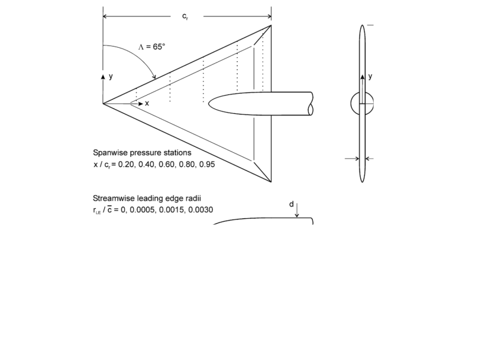
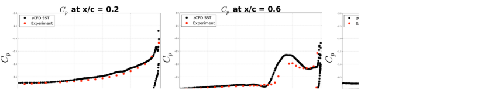
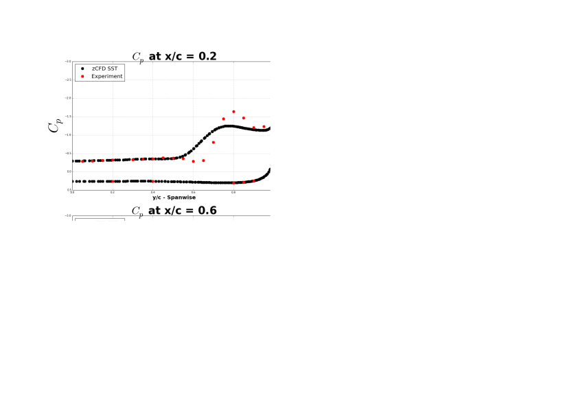
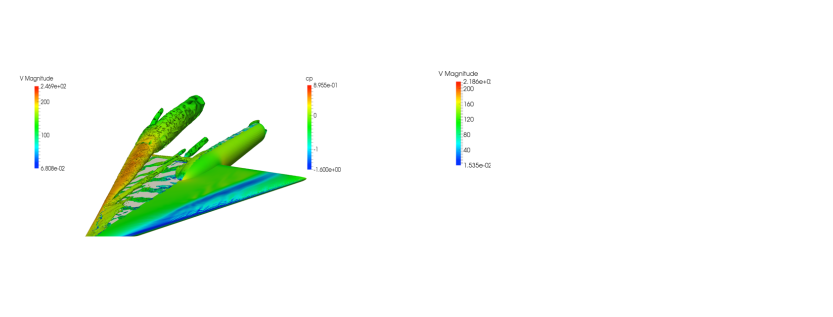

Numerical investigation of the flow field around :math:`65^\circ` delta wing using the unstructured code zCFD
=============================================================================================================

Authors: A. Cimpoeru (CFMS), J. Appa (Zenotech) and D. Standingford (Zenotech)

December 2014

Abstract
--------

In the present study the flow field around :math:`65^\circ` delta wing is investigated using the unstructured density based solver zCFD. The simulations were carried out by solving the steady state RANS equations using the k-ω SST turbulence model at :math:'13.3^\circ' flow angle for :math: 'Re=6.0e06' (NASA) and :math:'Re=3.0e06' based on MAC. Within this analysis the numerical solutions are compared against wind tunnel results performed at NASA and DLR. 

Geometry Specification
----------------------
	
The geometry has been generated using the analytical definition available in  the reference (Chu and Luckring). For the present study two sets of simulations were performed: (1) Comparison against the experiment performed at NASA and (2) Comparison against the experiment performed at DLR as part of the VFE 2 project. 

	Delta wing geometry 

Results 
-------

Steady state RANS, SOLAR - octree mesh (30M cells), :math:`Mach=0.4`, :math:`Re=6.0e06` (based on MAC = 0.3268 m)

:math:`\circ` Large Radius - Validation against NASA Wind Tunnel Experiment 

	
:math:`\circ` Sharp Radius - Validation against NASA Wind Tunnel Experiment 

:math:`\circ` Large (right) and Sharp radius (left)

.. seealso::

	`Experimental data and geometry specification (4 volumes available on NASA Technical Reports Server) <http://ntrs.nasa.gov/search.jsp?R=19960025648&hterms=delta+wing+65+volume&qs=N%3D0%26Ntk%3DAll%26Ntx%3Dmode%2Bmatchallany%26Ntt%3Ddelta%2Bwing%2B65%2Bvolume%2B1>`_

	`DLR Project VFE-2 <http://www.dlr.de/as/desktopdefault.aspx/tabid-4752/7866_read-12336//>`_

	J Chu and J M Luckring. Experimental Surface Pressure Data Obtained on 65 degrees Delta Wing Across Reynolds Number and Mach Number Ranges. NASA TM 4645, 1996
	
	R M Cummings and A Schute. Detached-Eddy Simulation od the vortical flow field about the VFE-2 delta wing. Aerospace Science and Technology 24 (2013) 66-76	

	R Konrath, C Klein and A Schroder. PSP and PIV investigations on the VFE-2 configuration in sub- and transonic flow. Aerospace Science and Technology 24 (2013) 22-31

	`Delta Wing Large Radius Notebook <http://nbviewer.ipython.org/github/zenotech/HyperFlux/blob/master/ipynb/NASA_Delta_Wing_65deg/delta_large.ipynb>`_

	`Delta Wing Sharp Radius Notebook <http://nbviewer.ipython.org/github/zenotech/HyperFlux/blob/master/ipynb/NASA_Delta_Wing_65deg/delta_sharp.ipynb>`_
	
	`Delta Wing Medium Radius DLR Notebook <http://nbviewer.ipython.org/github/zenotech/HyperFlux/blob/master/ipynb/NASA_Delta_Wing_65deg/DLR_EXP.ipynb>`_
	