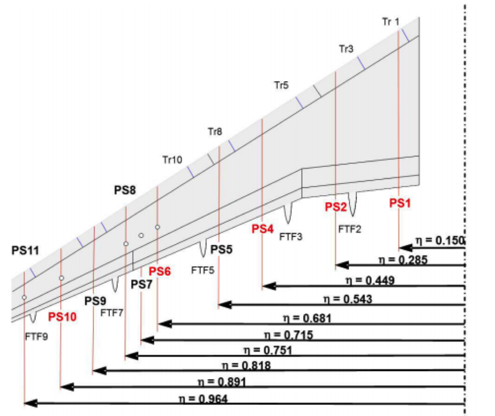

High Lift Prediction Workshop - Validation
==========================================

Authors: A. Cimpoeru (CFMS), J. Appa (Zenotech) and D. Standingford (Zenotech)

November 2014

Abstract
--------
This document summarizes some initial results obtained within the second order benchmarking of a new CFD software. The zCFD code was used for the DLR F11 high lift configuration in order to compute the flow field using the k-ω SST turbulence model. The results consist of high Reynolds number computations for the simplified (Case 1) and complex (Case 2B) configurations at :math:`7^\circ` angle of attack. The results were validated against the numerical solutions obtained using CFD++ and ANSYS FLUENT and showed a good agreement with the experimental data.

Introduction
------------
The zCFD code is a GPU accelerated high performance computational fluid dynamic software. The zCFD solver is an unstructured cell centered finite volume code which solves explicitly the compressible Navier-Stokes equations. The solution is preconditioned and the convergence is accelerated using the Multigrid technique along with a dual time stepping method. 
The results consist in high Reynolds number computations using k-ω SST turbulence model for the simplified (Case 1) and complex (Case 2B) configurations at :math:`7^\circ` angle of attack. The zCFD solutions were compared with wind tunnel data and other CFD codes such as Metacomp CFD++ and Ansys FLUENT. These codes were selected since they use the same cell-centered approach in combination with k-ω SST model. 

Results 
-------
Case 1, Coarse mesh (9.5M cells), :math:`Mach=0.175`, :math:`Re=15e6`, :math:`\alpha=7^\circ`

.. image:: images/ps01.*
	:width: 100%
	:align: center

.. image:: images/ps02.*
	:width: 100%
	:align: center

.. image:: images/ps04.*
	:width: 100%
	:align: center

.. image:: images/ps05.*
	:width: 100%
	:align: center

.. image:: images/ps06.*
	:width: 100%
	:align: center

.. image:: images/ps07.*
	:width: 100%
	:align: center

.. image:: images/ps08.*
	:width: 100%
	:align: center

.. image:: images/ps09.*
	:width: 100%
	:align: center

.. image:: images/ps10.*
	:width: 100%
	:align: center

.. image:: images/ps11.*
	:width: 100%
	:align: center

DLR F11 High Lift Configuration; Locations of Pressure Sections. For the full definition of cutting planes refer to workshop website.

	High lift stations

.. Notebooks
	`IPython Notebook <http://nbviewer.ipython.org/github/zenotech/HyperFlux/blob/master/ipynb/2nd_High_Lift_Prediction_Workshop/Case-1.ipynb>`_

