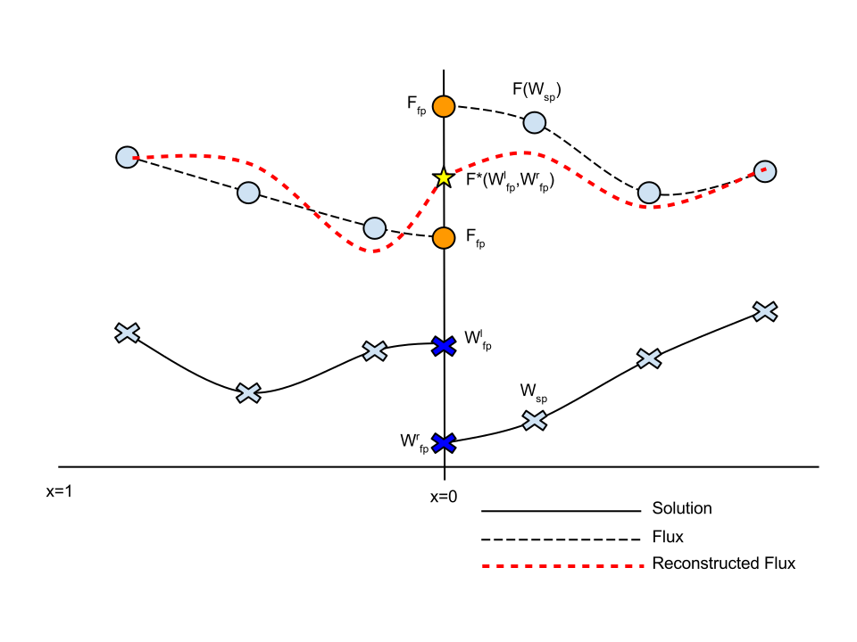

.. HyperFlux documentation master file, created by
   sphinx-quickstart on Wed Nov 26 11:29:39 2014.
   You can adapt this file completely to your liking, but it should at least
   contain the root `toctree` directive.

Welcome to the HyperFlux Project
=====================================

Contents:

.. toctree::
   :maxdepth: 1

   high-lift-workshop.rst

Indices and tables
==================

* :ref:`genindex`

