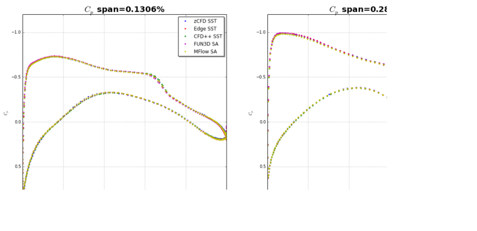

NASA Drag Prediction Workshop  - NASA Common Research Model - Validation
==========================================

Authors: A. Cimpoeru (CFMS), J. Appa (Zenotech) and D. Standingford (Zenotech)

December 2014

Configuration ( Wing-Body no Tail ) , L3 mesh unstructured hexahedral - 5.1 x 106 cells - Match CL = 0.5
-------------

	NASA Common Research Model
	
Conditions
----------
Reynolds number = 5.0 x e06 based on MAC

Mach = 0.85 

Angle of attack = 2.217

Reference static pressure = 101325 Pa

Reference static temperature = 310.928 K

RANS steady state 

k-W SST model 

Preconditioned

MUSCL scheme for 

Results
-------

:math:`\circ` Isosurfaces of Mach number 

:math:`\circ` CL match for L3 mesh unstructured hexahedral mesh 

+------------+------------+-----------+ 
| zCFD       | Experiment |   Error   | 
+============+============+===========+ 
| CL = 0.4884| CL = 0.508 |  -0.46 %  | 
+------------+------------+-----------+ 

:math:`\circ` Code to code validation

.. seealso::
	`Drag Prediction Workshop <http://aaac.larc.nasa.gov/tsab/cfdlarc/aiaa-dpw//>`_

	`NASA Common Research Model Notebook <http://nbviewer.ipython.org/github/zenotech/HyperFlux/blob/master/ipynb/NASA_CRM/CRM.ipynb>`_

	

