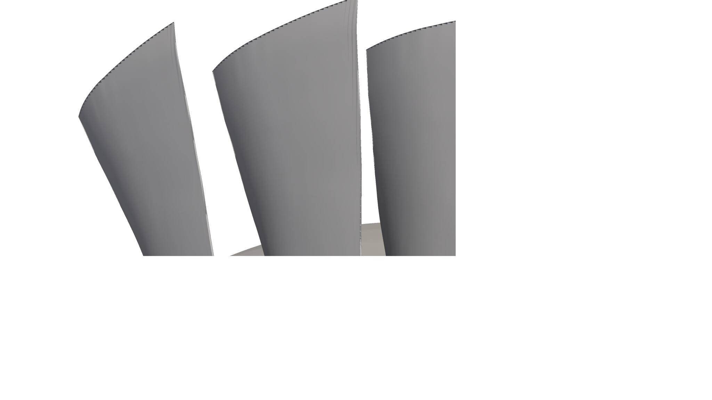
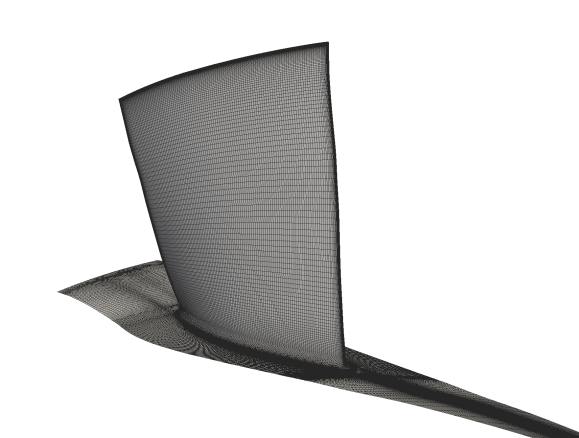
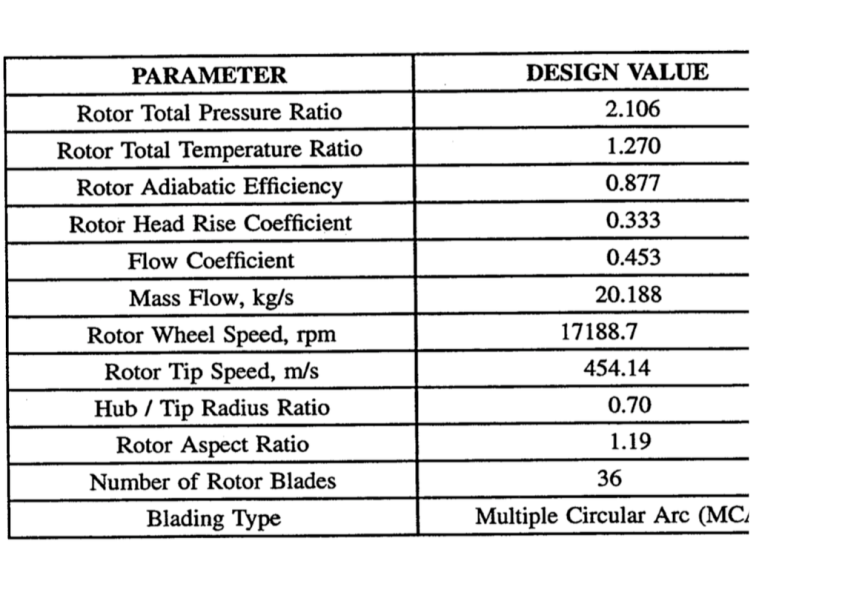
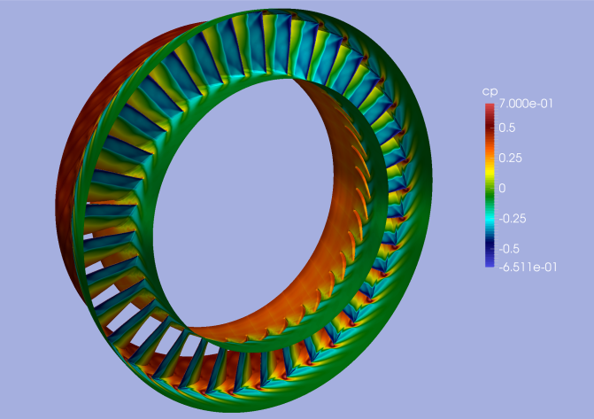
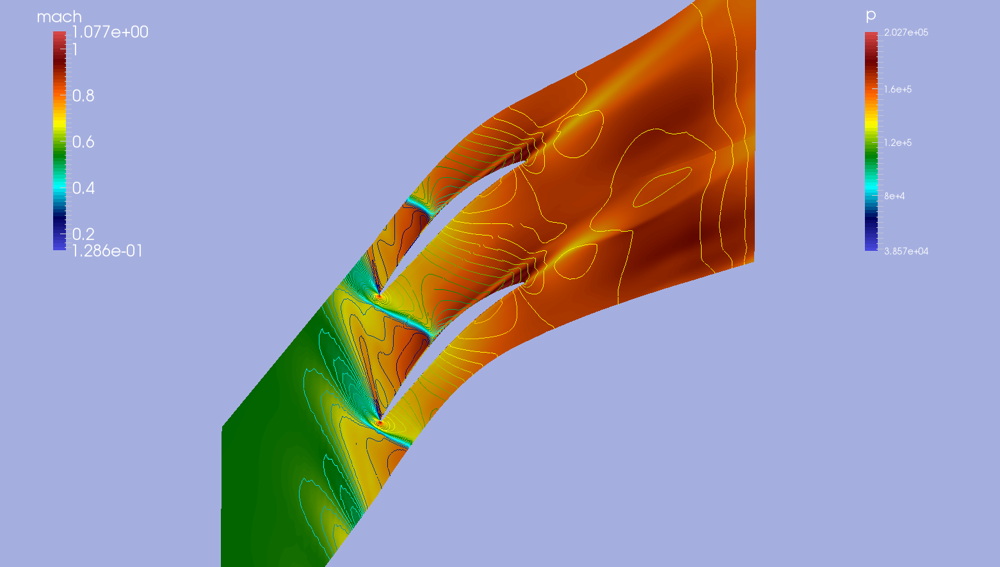
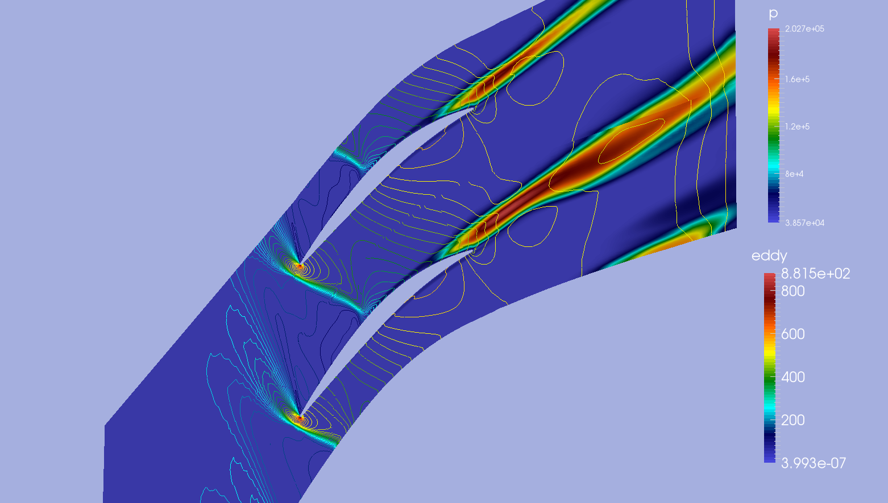

NASA Rotor 37 zCFD Code Validation - Flow Field in a Transonic Axial Compressor
===============================================================================

Authors: A. Cimpoeru (CFMS), J. Appa (Zenotech) and D. Standingford (Zenotech)

May 2015

Abstract
--------

Geometry and Mesh Generation (NASA ROTOR37)
-------------------------------------------

	

Parameters
----------

Initial Conditions (Steady-State RANS)
--------------------------------------

Ambient Conditions 

==============     =======    ===============
Variable           Value       Unit
==============     =======    ===============
P_amb              101523       Pa
T_amb              288.15       K
Rho_amb            1.225       Kg/:math:`m^3`
mu                 1.79e-5     Pa.s   
gas_constant       287.0       KJ/KgK
==============     =======    ===============

Inflow Total Conditions.

==============     =======
Variable           Ratio      
==============     =======    
Ptotal/P_amb       1.0       
T_total/T_amb      1.0   
==============     =======    

Results 
-------

Note that the map has been initially generated by varying the static pressure ratio on the outflow from 0.7 to 1.8 in order to determine the chocked and stalled conditions.

	Cp distribution the rotor blades

	Mach number in the flow field and pressure on the contours.

	Turbulent eddy viscosity and pressure contours

More results will be publised in the following weeks.

References
----------
.. seealso::

