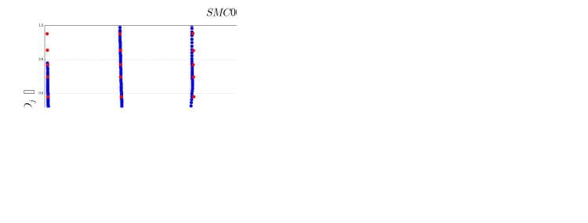

RANS simulations of cold jet flows from a serrated nozzle
=========================================================

Authors: A. Cimpoeru (CFMS), J. Appa (Zenotech) and D. Standingford (Zenotech)

February 2015

Abstract
--------

Geometry and Mesh Generation (SMC-006 Nozzle)
---------------------------------------------

	SMC006 chevron type nozzle. Left (Model) and Right (Domain Topology ) (Xia et. al. (2009))
 

	SMC006 mesh on x-y plane. Multiblock Stuctured Mesh (19M cells) (Xia H. and Tucker P. (2009))

Initial Conditions (Steady-State RANS)
--------------------------------------

Ambient Conditions 

==============     =======    ===============
Variable           Value       Unit
==============     =======    ===============
P_amb              97000       Pa
T_amb              280.2       K
Rho_amb            1.225       Kg/:math:`m^3`
mu                 1.79e-5     Pa.s
speed_of_sound     335.549     m/s        
gas_constant       287.0       KJ/KgK
==============     =======    ===============

Jet Conditions

==============     =======    ===========================
Variable           Value       
==============     =======    ===========================
NPR                1.83       Nozzle Pressure Ratio
TPR                1.022      Nozzle Temperature Ratio
Mjet               0.9        Jet Mach number  
Ujet               300        Reference Velocity [m/s]
Reynolds           1.03e06    Reynolds Number (See Note)
==============     =======    ===========================

Results 
-------

	Jet velocity profiles in the Tip-to-Tip plane at different stations

	

	Jet velocity profiles in the Notch plane at different stations 

	Comparison between LES study of Xia et. al. (2009) (top) and present RANS study (bottom) at different stations

.. figure:: images/smc006_Qcrit.svg
	:width: 50%
	:align: center
	:alt: alternate text
	:figclass: align-center

	Isosurfaces of Q criterion (present study)

* Note 

The Reynolds number is based on the jet diameter and reference velocity

.. seealso::

	'Hao Xia, Paul G. Tucker and Simon Eastwood (2009). Large-eddy simulations of chevron jet flows with noise predictions. International Journal of Heat and Fluid Flow 30 (2009) 1067-1079.'_

	'Hao Xia and Paul G. Tucker (2011). Numerical Simulation of a Single-Stream Jets from a Serrated Nozzle . Flow Turbulence Combust 2011.'_

	
	`Serrated Nozzle Notebook <http://nbviewer.ipython.org/github/zenotech/HyperFlux/blob/master/ipynb/Serrated%20Nozzle%20SMC006/smc006.ipynb>`_
	

	