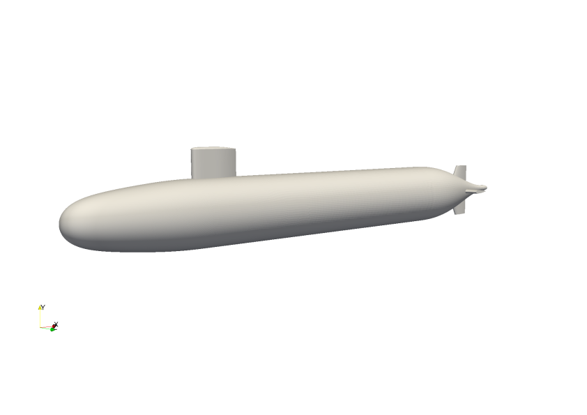
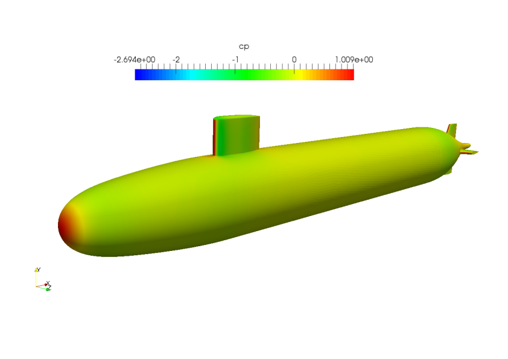
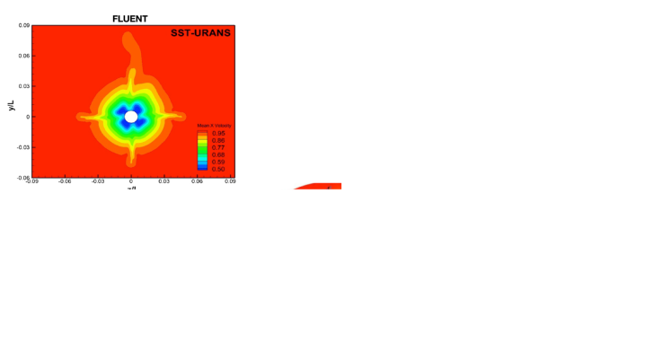

Validation of the flow field around DARPA SUBOFF model
======================================================

Authors: A. Cimpoeru (CFMS), J. Appa (Zenotech) and D. Standingford (Zenotech)

December 2014

Abstract
--------
In this section the flow field around DARPA SUBOFF geometry is computed using the unstructured cell centered finite volume density based solver zCFD. For this study the AFF8 configuration was employed due to complex flow features  such as boundary layer - vortex and vortex-vortex interactions. The Reynolds number for this test case is :math:`Re=1.2e07` and the employed turbulence model is k-ω SST. The steady state solutions are validated against wind tunnel data (see Reference) and have shown agreement.

Configuration (Axisymmetric hull + Fairwater + Stern appendages )
-------------

	SUBOFF Configuration 

Results 
-------

Steady state RANS, SOLAR - octree mesh (14 and 30 M cells), :math:`Mach=0.0179`, :math:`Re=1.2e7` (model length based)

.. figure:: images/suboff_cp.svg
	:width: 75%
	:align: center
	:alt: alternate text
	:figclass: align-center

	Coefficient of pressure in the symmetry plane 

	Coefficient of pressure contours 

Wake development ( Left -- Coarse Mesh ; Right -- Fine Mesh  )

.. figure:: images/suboff_SLIC1.svg
	:width: 60%
	:align: center
	:alt: alternate text
	:figclass: align-center

	x/L = 0.3

.. figure:: images/suboff_SLIC2.svg
	:width: 60%
	:align: center
	:alt: alternate text
	:figclass: align-center

	x/L = 0.4

.. figure:: images/suboff_SLIC3.svg
	:width: 60%
	:align: center
	:alt: alternate text
	:figclass: align-center

	x/L = 0.5

.. figure:: images/suboff_SLIC4.svg
	:width: 60%
	:align: center
	:alt: alternate text
	:figclass: align-center

	x/L = 0.978 (Propeller Plane)

Comparison against zCFD, experimental data and Bhushan et al (2013) (FLUENT)

	x/L = 0.978 (Propeller Plane)

.. seealso::
	`Summary of DARPA Suboff Experimental program data <http://www.dtic.mil/docs/citations/ADA359226/>`_

	`Geometric Characteristics of DARPA SUBOFF models <http://www.dtic.mil/docs/citations/ADA210642>`_

	'S. Bhushan, M. F. Alam and D. K. Walters. Evaluation of hybrid RANS/LES models for prediction of flow around surface combatant and Suboff geometries. Computer and Fluids 88 (2013) 834-849'
	
	`DARPA SUBOFF Notebook <http://nbviewer.ipython.org/github/zenotech/HyperFlux/blob/master/ipynb/SUBOFF_RANS/suboff.ipynb>`_
	

	